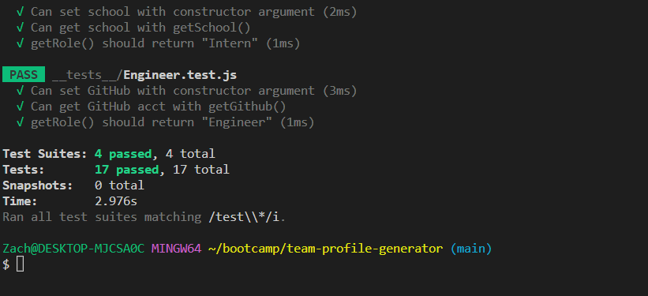
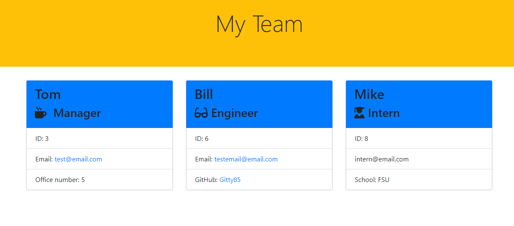

# team-profile-generator

## Table of Contents
1. [Description](#description)
2. [Visuals](#visuals)
3. [Testing](#testing)

## Description
[Link to HTML page in REPO]()
[Link to video submission]()
This project is intended to serve as a resource through which a user can dynamically generate a team profile, containing multiple job roles with specific information pertaining to each. Via the use of the Jest and Inquirer modules, the user is prompted for information, where that information is then populated onto a formatted HTML page. 
The finished product allows for quick, streamlined access to the team's individual emails, GitHub profiles, and role specific information. 

## Visuals

## Testing
Once user has pulled in required node modules, enter "npm test" in console to initiate tests (via Jest)